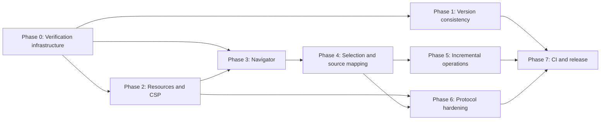

# Cosmic Canvas Quality Hardening Implementation Plan

## Purpose

This document turns the July 2026 repository review into an implementation contract. It starts from the current `0.1.3` codebase and focuses on the real reliability gaps that remain:

- different computers running different extension versions;
- delayed or script-generated decks not producing navigation;
- relative assets, document CSP, CDN policy, and sandbox differences;
- ambiguous element selection and container-versus-text editing;
- full-document work after small edits;
- insufficient browser, VS Code, packaging, and cross-machine release gates.

The older root-level `plan.md` remains useful as implementation history. This plan governs the next hardening cycle and does not reopen features that are already complete unless a verifier exposes a regression.

## Outcome contract

The hardening cycle is complete only when all of the following are true:

1. The running app, installed extension, package manifest, documentation, VSIX filename, and release metadata report the same version.
2. A deck added asynchronously after initial page load appears in navigation without requiring a click, scroll, or resize.
3. The editor explains why a document cannot become editable instead of remaining in an indefinite `Loading` state.
4. Local sibling assets work through the VS Code custom editor, or the UI reports each unresolved asset with an actionable reason.
5. A single click selects predictably, text editing is an explicit action, and container selection never flattens structured content.
6. Repeated elements map to the correct source location.
7. A small text edit does not require a full validation scan, full deck thumbnail rebuild, and full VS Code document replacement.
8. Browser, VS Code, compatibility, performance, package-content, and release verifiers run in CI and on a release candidate.

## Non-goals for this cycle

- Do not add AI cleanup, additional slide templates, or new export formats.
- Do not redesign the entire application shell.
- Do not weaken the iframe sandbox or CSP merely to make a fixture pass.
- Do not replace the DOM-based editor with a new framework without benchmark evidence that incremental repair is insufficient.
- Do not promise pixel-perfect editable PowerPoint export for arbitrary HTML.

## Baseline and evidence to preserve

Record this baseline before implementation begins:

```powershell
git status --short --branch
git rev-parse HEAD
node --version
npm --version
code --version
code --list-extensions --show-versions | rg -i "cosmic|local\.cosmic"
npm test
npm run build
npm run vscode:compile
npm audit --omit=dev
npx vsce ls --no-dependencies
```

Current reviewed baseline:

- branch: `main`, clean and aligned with `origin/main`;
- package/tag version: `0.1.3`;
- extension installed on the review computer: `local.cosmic-canvas@0.1.2`;
- README installation example: `0.1.1`;
- unit tests: 181 passing across 9 test files;
- web production build: passing, with a main-bundle size warning;
- VS Code TypeScript compile: passing;
- production dependency audit: zero known vulnerabilities.

Save the command output for the first implementation PR under `tmp/verification/baseline/`. Keep that directory ignored; it is evidence, not a release artifact.

## Implementation progress

Verified on 2026-07-10 against the completed working tree:

- [x] Phase 0: lifecycle states, timeout/failure UI, structured diagnostics, browser/extension/performance harnesses, and environment-bearing timing JSON are implemented.
- [x] Phase 1: app/extension/VS Code version reporting, visible version badge, version-neutral install docs, GitHub-release distribution, daily update notice, package verification, and SHA-256 generation are implemented.
- [x] Phase 2: CSP quarantine/restore, preflight resource classification, browser module-entrypoint hydration, bounded VS Code local resource mapping, narrow resource roots, and actionable resource diagnostics are implemented and exercised in both browser and extension hosts.
- [x] Phase 3: the independent Pages navigator observes delayed/rerendered decks, tracks visible pages, caches thumbnails, virtualizes 60-page lists, and supports document-scoped automatic/forced/selector/sibling/marked-page recovery.
- [x] Phase 4: single-click selection, explicit editing, Firefox caret fallback, Alt-click ancestor cycling, full virtualized Outline, editor-only hide/lock/pick-through, unsupported-target guidance, detached selection recovery, and structural source locations are implemented.
- [x] Phase 5: typed source operations, incremental CodeMirror changes, grouped typing history, guarded VS Code range edits, explicit full-document fallback telemetry, targeted thumbnail invalidation, lazy editor/export chunks, and enforced performance budgets are implemented.
- [x] Phase 6: per-preview 128-bit tokens, current-frame/source checks, strict payload validation, size limits, trusted-script spoof tests, runtime crash diagnostics, and a written threat model are implemented.
- [x] Phase 7 implementation: CI jobs, Chromium/Firefox/WebKit release matrix, VS Code 1.90/stable host matrix, performance artifacts, package hygiene, build-once checksum workflow, release/rollback docs, and a local release candidate are implemented. The exact candidate also passes a proxy-blocked offline host run. A physical second Windows profile/machine and macOS-or-Linux row remain external execution tasks.

Current canonical foundation gate:

```powershell
npm run verify:all
```

The stronger release gate is now `npm run verify:release`. The latest run proves 235 unit tests, production build, VS Code compile, 54 browser cases across Chromium/Firefox/WebKit, the packaged stable VS Code extension-host smoke, the performance budgets, package-content/version checks, and a zero-vulnerability production audit. The exact final VSIX was then run without rebuilding on VS Code 1.90, stable 1.128, and stable with a blocking proxy; all passed.

### Final local evidence

- `npm run verify:release`: passed on 2026-07-10.
- Browser matrix: 54/54 passed across Chromium, Firefox, and WebKit.
- Extension host: the exact candidate passed open/ready/range-edit/save/reopen with recursively bundled sibling CSS/image/font/module resources on VS Code 1.90.0, stable 1.128.0, and stable with network routed to a blocking proxy. It also passed after a real VSIX install into isolated user-data/extensions directories, using a separate test-driver extension.
- Performance report (`tmp/verification/performance/latest.json`): selection median 0.7 ms / p95 11.0 ms; 100,000-line typing median 0.9 ms / p95 14.1 ms; delayed slide insertion 476.1 ms after mutation; ten keystrokes produced one history transaction, one host range edit, and at most one thumbnail rebuild.
- Package verifier: 19 runtime listing entries, no source/tests/fixtures/plans/tmp files; package JSON, lockfile, XML manifest, VSIX package manifest, filename, release workflow, and checksum agree on `0.1.4`.
- Release candidate: `cosmic-canvas-0.1.4.vsix`, 21 archive files, 994,992 bytes.
- Release candidate SHA-256: `2bb6fd080c4fa2b521018b7773ff32e115d27b09823ef47daa38a9135fba4a33`.
- Rollback: GitHub release `v0.1.2` retains `cosmic-canvas-0.1.2.vsix` with GitHub-recorded SHA-256 `15a8ef4e3c1654b9705b8672a7f4e16e47212120340d0a12c3879b91c93a1964`.
- Production dependency audit: zero known vulnerabilities.

## Verification layers

Every phase must use the relevant layers below. A unit test alone is not sufficient for behavior that depends on iframe timing, CSP, VS Code resource URIs, browser layout, or extension packaging.

### V0: Static consistency

Use for manifests, documentation, build configuration, protocol definitions, and package contents.

Required checks:

```powershell
npm run build
npm run vscode:compile
git diff --check
rg -n "0\.1\.[0-9]+" package.json package-lock.json README.md
npx vsce ls --no-dependencies
```

Pass conditions:

- no TypeScript/build errors;
- no whitespace errors;
- no stale hardcoded install version;
- no fixtures, prototype output, source maps, temporary reports, or stress documents in the VSIX unless explicitly allowlisted.

### V1: Unit and protocol tests

Use Vitest/jsdom for deterministic functions, reducers, validators, mutation classification, source mapping, and bridge commands.

Required command:

```powershell
npm test
```

Pass conditions:

- all existing tests remain green;
- every new protocol command and message validator has positive and negative cases;
- tests prove that an intentionally reverted guard fails at least one assertion.

### V2: Real-browser integration tests

Add a committed Playwright suite and script:

```json
"test:browser": "playwright test"
```

Run against Chromium for every PR and Firefox/WebKit on the release matrix.

The suite must exercise the actual Vite app, iframe, injected bridge, pointer events, contenteditable behavior, delayed DOM mutations, CSP fixtures, and responsive layout. Screenshots are supporting evidence; DOM assertions and state transitions are the pass/fail authority.

### V3: VS Code extension-host tests

Add a packaged-extension smoke suite using the VS Code extension test host. A dev-only test dependency may be added after confirming its maintenance and license status.

Required coverage:

- install/activate the built extension;
- open an `.html` fixture with `vscode.openWith`;
- verify the outer webview loads;
- verify the inner editor bridge reaches `ready`;
- edit text, save, close, reopen, and confirm the saved document;
- verify a sibling CSS file and image load;
- run against minimum supported VS Code `1.90` and current stable before release.

### V4: Compatibility fixtures

Add durable fixtures under `fixtures/compatibility/`:

- `plain-page/`;
- `explicit-deck/`;
- `delayed-deck/` with slides inserted after 400 ms;
- `framework-rerender/` that replaces a selected subtree;
- `relative-assets/` with sibling CSS, image, font, and module script;
- `restrictive-csp/` with `script-src 'none'`;
- `external-assets/` with allowed, blocked, and offline URLs;
- `repeated-elements/` containing indistinguishable `.card` structures;
- `overlay-hit-test/` with absolute overlays and pointer-event variations;
- `large-deck/` generated deterministically at 60 slides;
- `large-document/` generated deterministically at approximately 100,000 lines.

Fixtures must be small where possible and generated when large. Generated stress artifacts must remain out of the VSIX.

### V5: Performance verification

Create `npm run test:perf` with a machine-readable JSON report. Record OS, CPU, memory, browser, VS Code version, commit, and run count.

Initial budgets on the documented reference machine:

- selection acknowledgment for a 60-slide deck: median at or below 75 ms, p95 at or below 150 ms;
- typing acknowledgment in a 100,000-line document: median at or below 50 ms, p95 at or below 100 ms;
- asynchronous slide insertion to navigator visibility: at or below 750 ms after insertion;
- unrelated text edit rebuilds at most one thumbnail;
- ten keystrokes in one burst create one history transaction and at most one debounced VS Code host edit;
- no single editor-owned long task above 200 ms in the 60-slide smoke.

If the current baseline already exceeds a budget, record the baseline and require at least a 30% improvement without regression elsewhere. Do not silently relax a budget.

### V6: Security and sandbox verification

Required cases:

- forged bridge messages without the current session token are ignored;
- malformed payloads cannot mutate source or trigger a save;
- trusted author scripts cannot impersonate editor protocol messages;
- untrusted mode never runs author scripts or inline event handlers;
- trusted mode does not gain `allow-same-origin` without a separate security review;
- CSP/resource compatibility work does not broaden the outer webview policy beyond the documented need;
- JavaScript URLs remain rejected by link/export paths.

### V7: Manual usability and accessibility smoke

Run after automated gates pass:

- keyboard-only selection, navigation, text entry, escape, save, and undo;
- screen-reader names for the navigator, current slide, selected element, diagnostics, and editing state;
- 200% zoom and narrow VS Code editor-group width;
- light and dark VS Code themes;
- high-contrast mode;
- mouse and trackpad behavior for selection, ancestor cycling, reordering, and resizing.

Capture a short result table rather than relying on screenshots alone.

### V8: Cross-machine and release-candidate verification

Test the exact release-candidate VSIX, identified by SHA-256, on at least:

- the primary Windows development machine;
- a clean Windows user profile or second Windows machine;
- one macOS or Linux machine/VM;
- one restricted-network or simulated-offline run;
- minimum supported VS Code and current stable.

The same VSIX hash must be used on every machine. Record only environment facts and outcomes; do not collect user document contents.

## Phase 0: Verification infrastructure and observability

### Implementation

1. Add shared test helpers for starting Vite, loading fixture HTML, entering iframe modes, waiting for bridge readiness, and collecting diagnostics.
2. Add a bridge lifecycle state machine: `loading`, `ready`, `degraded`, and `failed`.
3. Add structured diagnostic codes rather than matching user-facing strings.
4. Add a development-only timing collector for deck detection, thumbnail generation, selection publication, audit scans, serialization, source cleanup, and host updates.
5. Add proposed scripts:

```json
"test:browser": "playwright test",
"test:perf": "playwright test tests/performance",
"test:extension": "node scripts/run-extension-tests.mjs",
"verify:package": "node scripts/verify-package.mjs",
"verify:all": "npm test && npm run build && npm run vscode:compile && npm run test:browser && npm run verify:package"
```

### Verifiers

- V0: all scripts resolve and do not modify tracked fixtures.
- V1: lifecycle reducer and diagnostic code tests.
- V2: plain page reaches `ready`; intentionally blocked bridge reaches `failed` with a code.
- V5: timing report has the required environment metadata.

### Exit gate

- [x] A failed bridge can no longer leave the shell in indefinite `Loading`.
- [x] Browser test failures include fixture name, lifecycle state, and diagnostic code.
- [x] Baseline timing JSON is saved outside tracked release content.

## Phase 1: Version, installation, and release consistency

### Implementation

1. Expose the extension version from `ExtensionContext.extension.packageJSON.version` to the app.
2. Expose the browser-build version from a Vite build constant generated from `package.json`.
3. Add an About/Diagnostics surface with app version, host mode, VS Code version when available, trusted-script state, browser engine, document mode, and bridge state.
4. Replace hardcoded README VSIX versions with a version-neutral command or generated release snippet.
5. Add a package verifier that compares `package.json`, `package-lock.json`, compiled extension metadata, VSIX manifest, VSIX filename, and release metadata.
6. Add SHA-256 generation to the release workflow.
7. Decide explicitly between Marketplace auto-update and GitHub-release-only distribution. If GitHub-only remains, add a nonintrusive update notification.

### Verifiers

- V0: version consistency script fails when any one version is changed independently.
- V2: browser build displays the package version and host `Browser`.
- V3: extension displays the package version and host `VS Code`.
- V8: every machine reports the same version and VSIX SHA-256.

### Exit gate

- [x] No documentation points to `0.1.1` or any stale literal filename.
- [x] The running app always exposes its version without opening DevTools.
- [x] A stale installed extension is visibly distinguishable from the current release.

## Phase 2: Resource resolution, CSP compatibility, and failure diagnostics

### Implementation

1. Preserve `fileName` and document `uri` in application state instead of discarding them after the host message.
2. Add a resource-resolution abstraction used by preview, audit, and export.
3. In VS Code, allow the opened document directory as a narrow `localResourceRoot` and translate local resources through `webview.asWebviewUri` or a controlled host request.
4. Resolve or report relative `img`, `link`, `script`, `source`, media, font, CSS `url(...)`, and module-import dependencies.
5. Add a preflight resource report before the document becomes editable.
6. Detect author CSP that blocks the editor bridge. Preserve the author's original CSP for clean export while using an editor-safe preview policy that does not silently disable the bridge.
7. Add explicit diagnostics for blocked CDN, offline resource, CORS/opaque-origin failure, unsupported local path, inert script, and bridge timeout.
8. Document the sandbox matrix for Browser/VS Code and Trusted/Untrusted combinations.
9. Verify whether live-layout PowerPoint export is available in each matrix cell; label fallback export visibly when it is not.

### Verifiers

- V1: URI normalization, allowlist, CSP preservation, and diagnostic classification.
- V2: restrictive-CSP fixture reaches `ready` or a deliberate actionable `degraded` state within 2 seconds; never indefinite `Loading`.
- V3: sibling CSS, image, font, and module fixtures load from the document directory.
- V4: external assets report allowed, blocked, and offline cases separately.
- V6: no path outside the document directory or explicit allowlist can be read.
- V8: relative-assets fixture renders the same on each release-candidate machine.

### Exit gate

- [x] The compatibility fixture has zero unexplained missing resources.
- [x] Every blocked resource appears in diagnostics with its category and remediation.
- [x] The exported HTML retains the author's original CSP and resource references unless the user chose a self-contained export.

## Phase 3: Reactive, independent document navigator

### Product decision

Replace the bottom-only timeline with a collapsible vertical navigator adjacent to the canvas. Keep compact previous/next controls near the canvas title. Do not put the primary navigator inside the already crowded Inspector tab set.

### Implementation

1. Add `MutationObserver` support for structural document changes.
2. Coalesce mutations and classify them as deck-structural, active-slide-only, thumbnail-affecting, or irrelevant.
3. Use `IntersectionObserver` to track the active visible page/slide.
4. Add a navigator shell that remains available in a collapsed state even when no deck is detected.
5. Add manual recovery actions:
   - treat the selected element's siblings as pages;
   - choose a CSS selector;
   - mark/unmark an element as a page;
   - return to automatic detection.
6. Store manual detection settings per document, not globally.
7. Virtualize the slide list and lazily create thumbnails.
8. Cache thumbnails by slide id plus content revision.
9. Preserve rename, insert, duplicate, delete, and reorder behavior.
10. Ensure plain pages do not gain intrusive deck chrome; they receive only the collapsed navigator affordance.

### Verifiers

- V1: mutation classification, selector validation, manual-setting persistence, active-id reducer, and thumbnail invalidation.
- V2: delayed-deck fixture produces two navigator entries within 750 ms without interaction.
- V2: framework-rerender fixture preserves or safely clears selection and republishes navigation.
- V2: active page follows scrolling within 200 ms.
- V2: manual sibling mode recovers an intentionally ambiguous deck.
- V5: 60-slide navigation meets selection and thumbnail budgets.
- V7: navigator works at narrow editor widths and 200% zoom.

### Exit gate

- [x] No test relies on scrolling or resizing to make the navigator appear.
- [x] An unrelated text edit does not rebuild every thumbnail.
- [x] Removing the bottom timeline increases rather than reduces usable canvas height.
- [x] All slide-management actions remain undoable.

## Phase 4: Predictable selection, explicit editing, outline tree, and source mapping

### Interaction contract

- Single click selects the hit-tested element.
- Double click or Enter begins text editing when a safe text target exists.
- Escape exits editing first and clears selection second.
- Alt-click cycles through eligible ancestors under the pointer.
- Structured containers remain selectable and styleable but are never flattened by text editing.
- Unsupported targets explain why they cannot be edited.

### Implementation

1. Separate `selectedElement` and `editingElement` state in the bridge protocol.
2. Remove automatic entry into contenteditable from ordinary selection.
3. Add deterministic ancestor cycling and a visible depth indicator.
4. Replace the sibling-only Layers view with a virtualized document outline tree.
5. Add lock/hide controls for editor selection only; never silently add author-facing attributes to clean export.
6. Add a temporary “ignore this overlay for picking” action.
7. Handle detached selections after framework rerenders.
8. Add explicit unsupported-target messages for canvas, cross-origin iframe, closed shadow root, pseudo-element content, and non-text SVG structures.
9. Replace regex-first source sync with a stable locator containing DOM ancestry, sibling occurrence, tag/id/class hints, and source range.
10. Keep source ranges updated through editor operations and fall back visibly when ambiguous.

### Verifiers

- V1: single-click/double-click state transitions, ancestor cycling, container safety, detached-node recovery, and source locator disambiguation.
- V2: clicking text inside a bordered card selects the text leaf; Alt-click reaches the card; outline selection reaches both deterministically.
- V2: single click never unexpectedly places a caret.
- V2: repeated-elements fixture maps the second and third `.card` to their correct source tags.
- V2: overlay fixture remains selectable through outline and ignore-overlay actions.
- V7: keyboard-only selection and editing contract.
- V6: author scripts cannot forge selection or editing state.

### Exit gate

- [x] No structured container becomes contenteditable through single click.
- [x] Every selected element has a deterministic path in the outline.
- [x] Source sync never silently labels an ambiguous first match as correct.

## Phase 5: Incremental document operations, history, and performance

### Implementation

1. Define typed edit operations for text, attribute, style, class, insert, delete, move, reorder, and replace-subtree changes.
2. Send operations from the iframe rather than serialized full HTML for routine edits.
3. Maintain a canonical document model in the app and apply operations to source ranges.
4. Reserve full serialization for initial load, explicit source Apply, recovery, compatibility fallback, and export verification.
5. Group typing bursts into one history transaction.
6. Cancel or flush pending history timers before undo, redo, reload, checkpoint restore, and document switch.
7. Apply targeted VS Code edits when a reliable range exists; use full replacement only as a visible fallback.
8. Move full audit scans to idle/on-demand execution and add targeted validation for changed nodes.
9. Cache deck structure, selected styles, layer structure, and thumbnails by revision.
10. Lazy-load PowerPoint export dependencies so ordinary editing does not pay the full bundle cost.
11. Add fallback telemetry to the diagnostics panel: operation applied incrementally, range ambiguous, full-reserialize fallback, and host full-replace fallback.

### Verifiers

- V1: every operation round-trips source to equivalent DOM and clean export.
- V1: undo/redo around pending typing never creates a phantom redo entry.
- V1: operation ordering remains deterministic under rapid edits.
- V2: ten typed characters remain visually stable and produce one history entry.
- V3: one text edit preserves the VS Code cursor and unrelated source formatting.
- V3: one undo reverts one typing burst.
- V5: large-document and 60-slide budgets pass.
- V0: main bundle no longer emits the existing oversized-chunk warning, or the remaining warning has a documented reviewed exception.

### Exit gate

- [x] Routine text/style edits do not serialize the whole document.
- [x] Routine edits do not run a full document audit.
- [x] VS Code does not replace the entire document when a precise range is available.
- [x] Clean export remains free of all editor metadata.

## Phase 6: Bridge protocol and trusted-script hardening

### Implementation

1. Generate a per-preview session token in the app and inject it into the editor bridge.
2. Require the token on every command and bridge message.
3. Replace message-type-only checks with strict payload validators.
4. Reject messages from the wrong `source`, wrong session, stale iframe revision, or invalid payload.
5. Separate author-script events from editor protocol events.
6. Add maximum payload limits and diagnostic logging for rejected messages without echoing document content.
7. Review all wildcard `postMessage` calls and document why each remaining wildcard is necessary for opaque sandbox origins.
8. Add a threat-model note covering trusted scripts, local files, resource access, save authority, clipboard, and export.

### Verifiers

- V1/V6: wrong token, stale token, missing token, oversized payload, wrong source, and malformed message are ignored.
- V2: trusted-script fixture attempts to spoof selection and document-change messages and fails.
- V3: legitimate edit/save traffic still succeeds through the extension host.
- V0: protocol types and runtime validators remain synchronized.

### Exit gate

- [x] Only the injected bridge for the current iframe revision can mutate editor state.
- [x] A trusted author script cannot directly cause a VS Code document save or replacement through protocol impersonation.

## Phase 7: CI, package hygiene, documentation, and release

### Implementation

1. Add CI jobs for:
   - unit/type/build;
   - Chromium browser integration;
   - Firefox/WebKit release matrix;
   - extension-host smoke;
   - performance comparison;
   - package-content and version verification;
   - dependency audit.
2. Tighten `.vscodeignore` so prototypes, fixtures, plans, output decks, test helpers, and temporary reports are excluded unless required at runtime.
3. Add a reproducible VSIX build command and checksum output.
4. Update README architecture, installation, diagnostics, navigator, selection model, asset behavior, sandbox matrix, and known limitations.
5. Add a release checklist and rollback procedure.
6. Build the release candidate once; do not rebuild separately per machine.

### Verifiers

- V0: clean checkout produces the same package-content list and expected version.
- V3: install the built VSIX and complete open/edit/save/reopen smoke.
- V8: run the exact candidate hash on the cross-machine matrix.
- Git verification:

```powershell
git status --short --branch
git diff --check
git diff --stat
```

### Exit gate

- [x] CI jobs are defined for every required gate; branch protection must mark them required after the workflow first runs on GitHub.
- [x] VSIX contains only runtime assets, manifest/docs required for distribution, and license.
- [x] README and diagnostics describe the exact shipped behavior.
- [ ] Cross-machine results have no unexplained difference.
- [x] Rollback artifact and previous stable version remain available (`v0.1.2` VSIX verified on GitHub).

## Implementation sequence and dependency graph



Recommended PR sequence:

1. Verification harness and lifecycle diagnostics.
2. Version consistency and About/Diagnostics.
3. Resource resolver, CSP handling, and compatibility fixtures.
4. Reactive navigator and delayed-deck recovery.
5. Explicit selection/editing model and outline tree.
6. Stable source locations and incremental operation protocol.
7. Performance optimization and lazy PowerPoint bundle.
8. Protocol hardening.
9. CI, package cleanup, documentation, and release candidate.

Each PR must be independently releasable or guarded behind a disabled-by-default feature flag. Do not maintain two editing protocols indefinitely; remove the old full-document path after the incremental path passes the compatibility matrix, retaining only a deliberate fallback.

## Stop rules

Stop the current phase and fix the blocker before continuing when any of these occurs:

- a clean-export test detects editor metadata;
- source formatting or unrelated content changes after a targeted edit;
- a security verifier requires broadening local file access or sandbox permissions;
- a performance change improves one fixture while regressing another by more than 20%;
- an automated test needs arbitrary sleep rather than a lifecycle/state condition, except for fixtures explicitly testing delayed behavior;
- browser behavior cannot be reproduced outside jsdom;
- the VSIX being tested differs by hash across machines;
- a new dependency is proposed without maintenance, license, size, and necessity review;
- a phase changes product behavior beyond the non-goals or acceptance contract in this document.

## Per-PR completion template

Copy this section into each implementation PR:

```markdown
### Scope
- Phase/item:
- User-visible behavior:
- Explicitly out of scope:

### Verification
- [ ] V0 static consistency
- [ ] V1 unit/protocol tests
- [ ] V2 browser integration, if applicable
- [ ] V3 extension-host, if applicable
- [ ] V4 compatibility fixture, if applicable
- [ ] V5 performance, if applicable
- [ ] V6 security/sandbox, if applicable
- [ ] V7 manual usability/accessibility, if applicable
- [ ] Clean export contains no editor metadata

### Evidence
- Commit:
- Commands and results:
- Fixture names:
- Performance report:
- Known limitations:
- Rollback method:
```

## Final release command gate

The exact scripts may evolve in Phase 0, but the final release must have one canonical gate equivalent to:

```powershell
npm ci
npm test
npm run build
npm run vscode:compile
npm run test:browser
npm run test:extension
npm run test:perf
npm run verify:package
npm audit --omit=dev
npm run vsix
git diff --check
git status --short --branch
```

The release is complete only after the generated VSIX is installed and smoke-tested, its SHA-256 is recorded, and the same artifact passes the cross-machine matrix.
